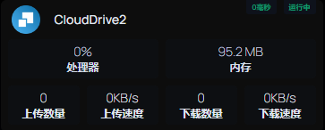

# CloudDriver HomePage自定义API

# 插件安装不上
容器内执行 `pip install clouddrive`



HomePage services.yaml配置
```angular2html
- CloudDrive2:
    icon: /icons/icon/clouddrive.png
    href: http://cd2ip:cd2端口/
    ping: http://cd2ip:cd2端口
    #server: unraid
    #container: CloudDrive
    showStats: true
    display: list
    widget:
        type: customapi
        url: http://mp_ip:mp_port/api/v1/plugin/Cd2Assistant/homepage?apikey=mp_apikey
        method: GET
        mappings:
            # - field: uptime
            #   label: 运行时间
            - field: upload_count
              label: 上传数量
            - field: upload_speed
              label: 上传速度
            - field: download_count
              label: 下载数量
            - field: download_speed
              label: 下载速度
              
            # - field: cloud_space
            #   label: 剩余空间
```

### 自定义API Response字段
- cpuUsage： CPU使用率
- memUsageKB： 内存使用量
- uptime： 运行时间
- upload_count： 上传数量
- upload_speed： 上传速度
- download_count： 下载数量
- download_speed： 下载速度
- cloud_space： 剩余空间

### HomePage自定义API文档
https://gethomepage.dev/latest/widgets/services/customapi/#custom-request-body