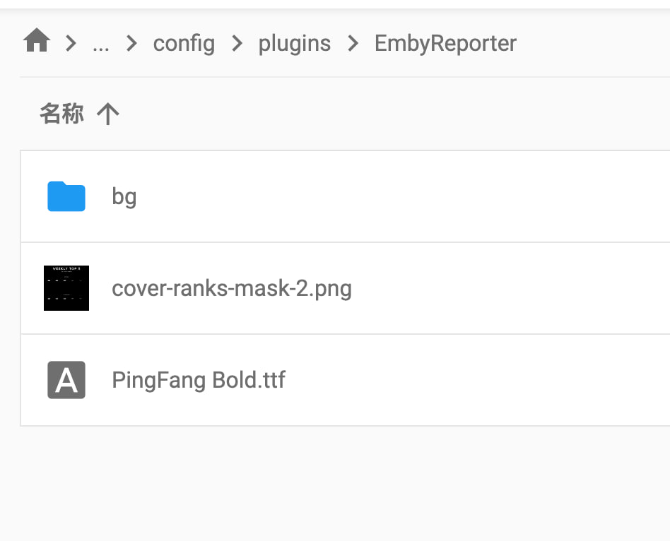
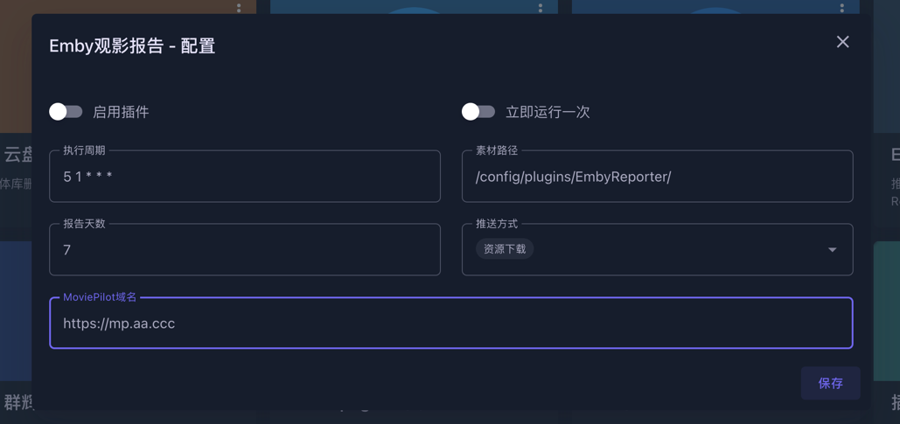

# Emby观影报告

### 使用说明

**注意**：需 `Emby` 安装 `Playback Report` 插件

将本项目**下载到本地**，并将 `/data/EmbyReporter/res` 下文件路径映射到 `MoviePilot` 容器可访问的目录下，如 `/config/plugins/EmbyReporter`

  
 <b>具体步骤</b> 

  1. 下载源码：`git clone https://github.com/thsrite/MoviePilot-Plugins.git` 或者从网页直接下载并解压
  2. 复制 `/data/EmbyReporter/res` 到容器可访问目录，如 `/config/plugins/EmbyReporter`
  3. 配置该插件的素材路径 `/config/plugins/EmbyReporter/`，如下面图中所示
  4. 立即运行一次，如果网络正常，`tg` 通道已配置的话，`tg` 即可收到推送

