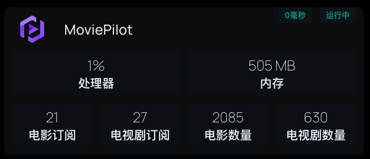

# HomePage自定义API



HomePage services.yaml配置
```angular2html
- MoviePilot:
    icon: /icons/icon/MoviePilot.png
    href: http://192.168.31.103:3003
    ping: http://192.168.31.103:3003
    # server: unraid
    # container: MoviePilot
    showStats: true
    widget:
        type: customapi
        url: http://192.168.31.103:3003/api/v1/plugin/HomePage/statistic?apikey=XGV2BNoRjK5YPD
        method: GET
        mappings:
            - field: movie_subscribes
              label: 电影订阅
            - field: tv_subscribes
              label: 电视剧订阅
            - field: movie_count
              label: 电影数量
            - field: tv_count
              label: 电视剧数量
            # - field: episode_count
            #   label: 电影剧集数量
            # - field: user_count
            #   label: 用户数量
            # - field: total_storage
            #   label: 总空间
            # - field: free_storage
            #   label: 剩余空间
```

### 自定义API Response字段
- movie_subscribes： 电影订阅
- tv_subscribes： 电视剧订阅
- movie_count： 电影数量
- tv_count： 电视剧数量
- episode_count： 电影剧集数量
- user_count： 用户数量
- total_storage： 总空间
- used_storage： 已用空间
- free_storage： 剩余空间

### HomePage自定义API文档
https://gethomepage.dev/latest/widgets/services/customapi/#custom-request-body